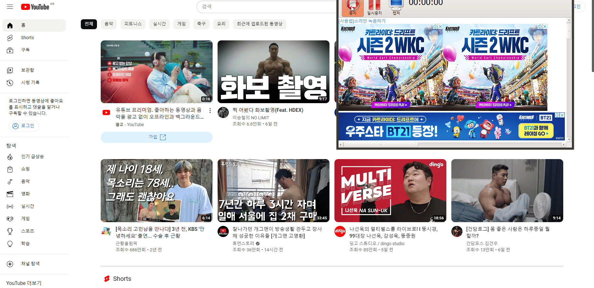
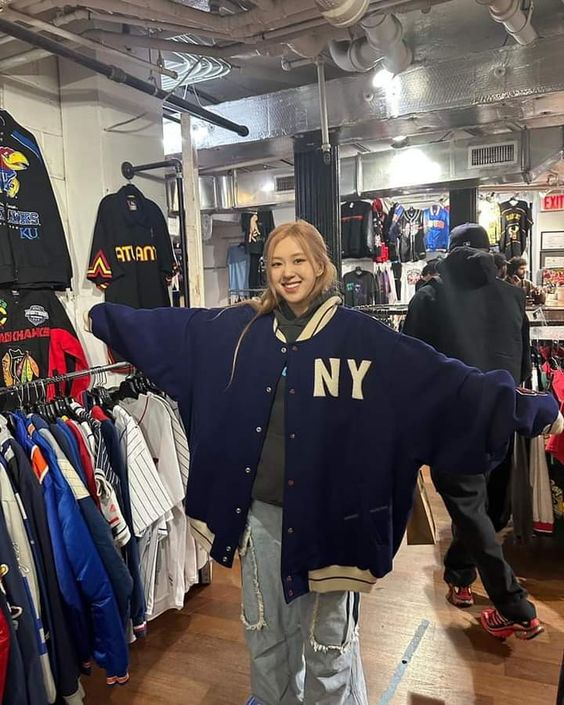

# 프로젝트명 - 회사 프로젝트제작(팀작업)

## 팀원
<!-- FE(프론트엔드), BE(백엔드) -->
FE/BE | 이름 | Github | 작업사항
:---|:---|:---|:---
FE|김기철[@abcd](http://github.com/abcd)|[회사소개](http://~),[회원가입](http://~)
FE/BE|정종우[@abcd](http://github.com/abcd)|[회사소개](http://~),[회원가입](http://~)
FE|이원철[@abcd](http://github.com/abcd)|[회사소개](http://~),[회원가입](http://~)
FE|추경[@abcd](http://github.com/abcd)|[회사소개](http://~),[회원가입](http://~)

## 프로젝트 사이트
[프로젝트 바로가기](http://github.com/~)

작업 | 주소
---|---
FE | [작업] : http://github.com
BE | [작업] : http://github.com

## 프로젝트 기획서
[프로젝트 기획서 pdf](http://pdf~)

## 프로젝트 영상

# 프로젝트 기능구현
## 프로젝트 기능 리스트
- [x] 1.메뉴 구현
- [x] 2.비쥬얼 배너 구현
- [ ] 3.컨텐츠 롤링 구현 (작업중)
- [x] 4.탑버튼 구현

### 1. 메뉴구현
- [x] 리뉴얼 디자인, html/css/vanilla js

#### 기획서에 들어가는 내용 작성

#### 전

### 후
